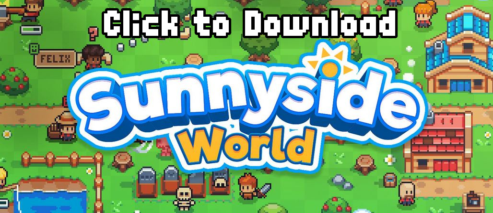

# Godot Tutorials (Godot 3.x only)

A curation of Godot tutorial source code created by bitbrain.

## List of Tutorials

- [Procedural Cave Generation](/procedural-caves) ([📺 watch on Youtube](https://www.youtube.com/watch?v=lFIBn8kJ-IM))
- [XBox Controller Support](/xbox-controller-support) ([📺 watch on Youtube](https://www.youtube.com/watch?v=Ox1kMM0qcTk))
- [Parallax Scrolling](/parallax-scrolling) ([📺 watch on Youtube](https://www.youtube.com/watch?v=f8z4x6R7OSM))
- [2D Lighting and Day/Night cycle](/2d-lighting) ([📺 watch on Youtube](https://www.youtube.com/watch?v=j_FMsL_ru1w))
- [RPG Character Animations](/rpg-animations) ([📺 watch on Youtube](https://www.youtube.com/watch?v=a3N9Acx3ovg))
- [AI Behaviour Trees](/behaviour-tree) ([📺 watch on Youtube](https://www.youtube.com/watch?v=n0gVEA1dyPQ))
- [2D Navigation](/navigation-server) ([📺 watch on Youtube](https://www.youtube.com/watch?v=_MTJ9Qz0gJk))

## 🌳 Activate Sunnyside asset pack

Some of my tutorials feature assets from the [Sunnyside World asset pack](https://danieldiggle.itch.io/sunnyside). You can download the assets here:

Then, extract the relevant assets into the assets/ folder! Please be aware that you are not permitted to push these to a public repository.
