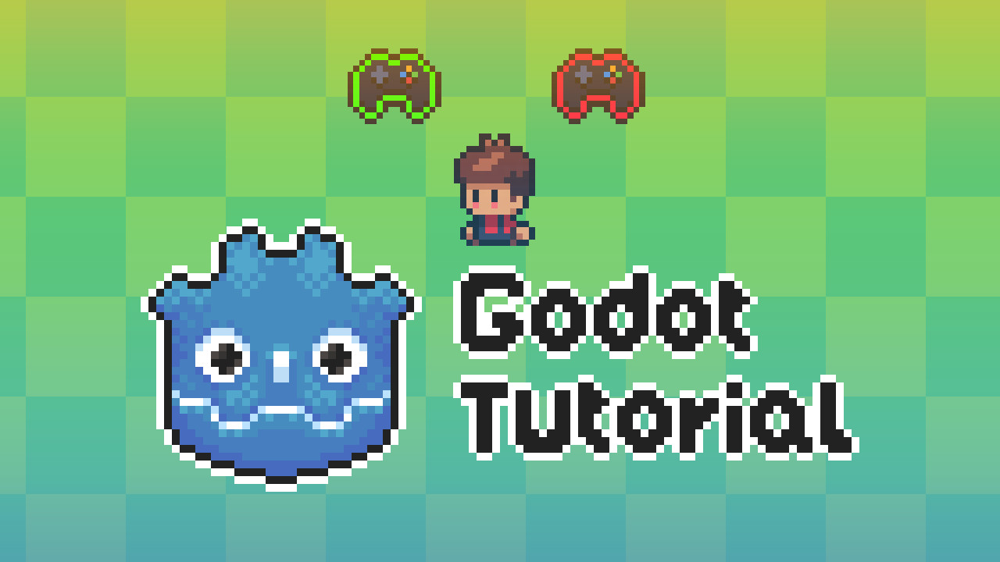

# Godot Tutorial: Xbox Controller Support

In this tutorial I am going to guide you through the process of adding Xbox controller support such as:

- automatic detection of connecting/disconnecting controllers
- displaying current controls on the screen
- displaying when controllers are connected/disconnected
